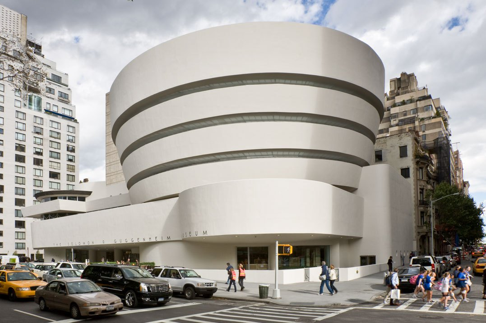
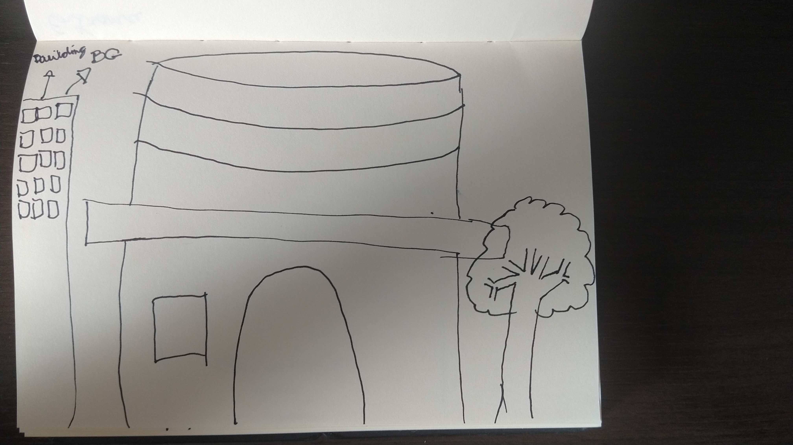
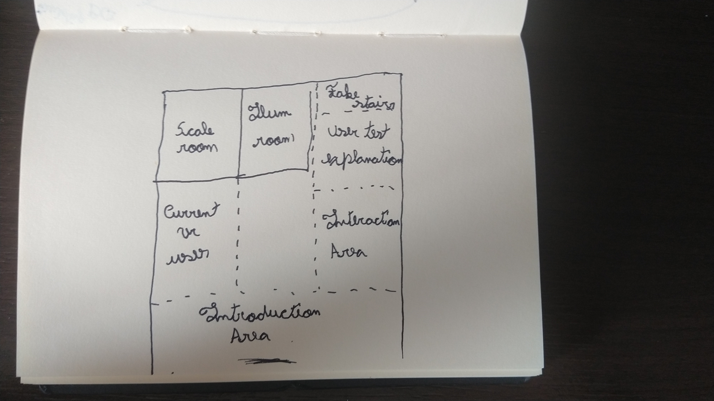

# Night at the museum
Virtual Reality for consumers is starting to grow outside of gaming, it is being used for science, medical and enginneering projects. This project shows, in VR, what are the advantages of using it in the architecture field.

The project is made for an assignment on the Udacity's VR Nanodegree program and this documentation shows the steps taken to make it.

*The following statements are all from the assignment itself:*
> Create a virtual reality experience to mobile devices with "information stands". Offering visual and audio reproduction exposing what you've found in the field you chose.

> Analyzing companies and VR apps or fields that could be impacted by VR and how they could be impacted.

> One or more company. One or more VR app (how VR is used). One field or more that has the potential to VR and how it could be impacted by it.

## Objective
I chose the architecture field so I had to make some research in it. After reading about VR applications currently in the field, I wanted to make a bit of both: Display what we have today, and what VR could help architects with.

>_The biggest challenge is often convincing the client that the finished article will look just like — or better than — the 2D or 3D representation.[...] Is working with a client to convince them that a design works_  
-[Tmd studio](https://www.tmd.studio/) on [Virtual Reality Uses in Architecture and Design](https://medium.com/studiotmd/virtual-reality-uses-in-architecture-and-design-c5d54b7c1e89)

I come up with the following **five topics** as my main objective to exibit:
- Companies and apps that use VR to help architecture today
- Sense of scale and how it can help conveil and transpose ideas to the end user/client's mind
- How VR can help the architect test illumination interaction between rooms and objects
- How VR can help the architect get feedback from the user/client to get the desired result from both sides

## Target audience
This is a museum app so it might not be much interesting for every person. A person that might use is someone curious and that takes interest in museums or modern exibitions.

### Persona

	
     
    <i>Mid 30 woman interested in a nice VR experience</i>

Mariana - 34 y.o - Police officer - _"Tecnology is changing how people interact and there's a good outcome of it"_

Mariana is saving money to build her own house and she wants help of an architect, one option costs more but offers VR displays of the project and she is not sure if she should take it.  
Her nephew had a VR headset and she asked him if he could show to her, maybe that could help her see what VR is like and decide if she should contract that option or not.

VR Experience: none.

## Making a museum
I don't have much experience in museums myself so I took some time to think what I'd want for one. After thinking about what I wanted the outside of it to look like, I searched for "modern museum" on google and found exactly what I had in mind, a circular design:

	
     
    <i>Solomon R. Guggenheim Museum</i>

### Sketches
After finding the museum design I tried to sketch something around it. It wasn't really needed since the above picture was exactly what I wanted to use as a starting point, but it is a good practice to sketch to put my **_non existant_** sketching skill in practice.

	
     
    <i>Sketch tentative</i>

My drawing skills are on par with 2 year old kid, but we gotta live with what we have 🙃.

The sketch has the following key elements:
- I wanted a city as a background skybox
- I wanted some trees around the entrance
- I wanted to make the exterior(Some projects start already on the interior)

After sketching I followed up with a flooring, to help distribute the elements _inside_ the museum around the **five topics** I want to exibit.

	
     
    <i>The flooring can help you visualize before making it</i>

The flooring helps with the key elements:
- Even though the outside is circular, the interior should be squared.
- There will be rooms inside the museum and open areas(dashed)
- Where everything will be displayed